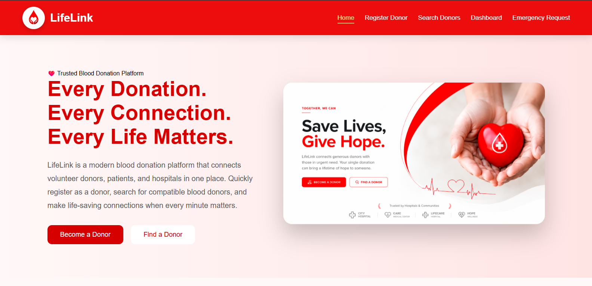
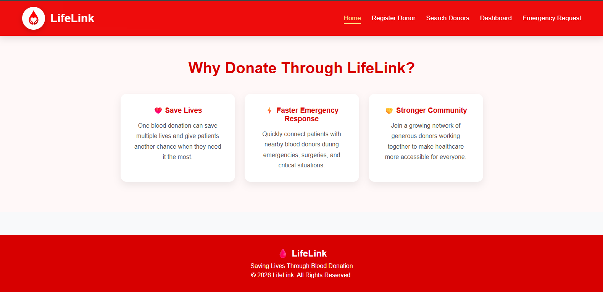
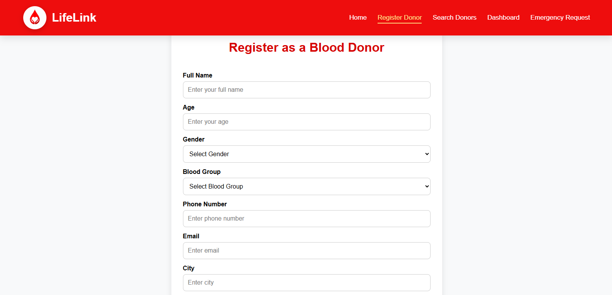
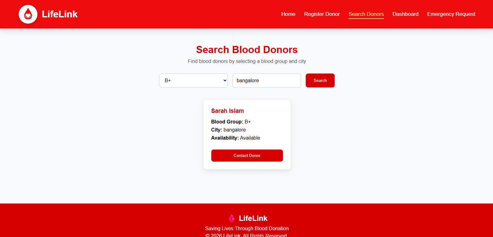
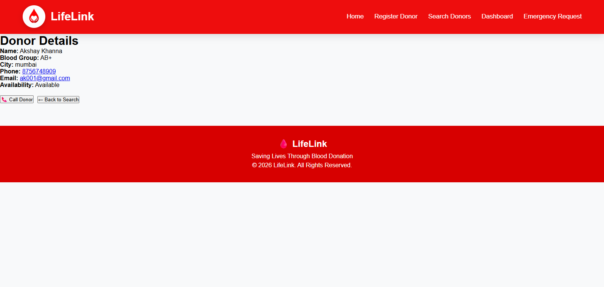
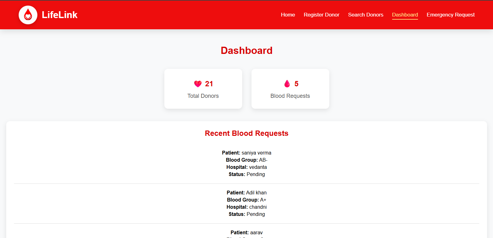
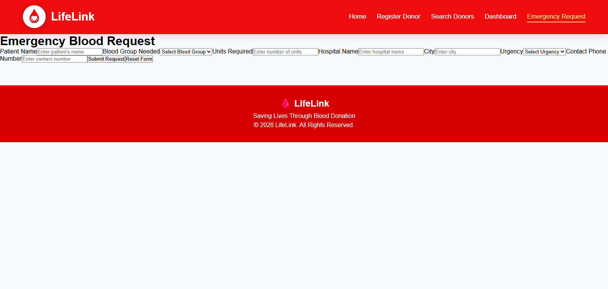

# 🩸 LifeLink

LifeLink is a full-stack Blood Donation Management System designed to connect blood donors with people in need. The platform allows users to register as donors, search for available donors by blood group and city, submit emergency blood requests, and view donor details through a clean and responsive interface.

## 🌐 Live Demo

https://lifelink-frontend-77fy.onrender.com

## 📂 GitHub Repository

https://github.com/sarahislamsiddiqui/LifeLink

## ✨ Features

- Register as a blood donor
- Search donors by blood group and city
- View detailed donor information
- Submit emergency blood requests
- Responsive user interface
- Firebase Firestore database integration
- RESTful backend APIs

## 🛠️ Tech Stack

### Frontend
- React
- Vite
- React Router
- CSS3

### Backend
- Node.js
- Express.js

### Database
- Firebase Firestore

### Deployment
- Render (Frontend & Backend)

### Version Control
- Git
- GitHub

## 🏗️ Project Architecture

```
React (Frontend)
        │
        ▼
Express.js REST API
        │
        ▼
Firebase Firestore
```

## 🚀 Installation

### 1. Clone the repository

```bash
git clone https://github.com/sarahislamsiddiqui/LifeLink.git
```

### 2. Navigate to the project folder

```bash
cd LifeLink
```

### 3. Install frontend dependencies

```bash
npm install
```

### 4. Start the frontend

```bash
npm run dev
```

### 5. Start the backend

```bash
cd server
npm install
node index.js
```

## 📸 Screenshots

### Home Page (Top)



### Home Page (Bottom)



### Register Donor



### Search Donors



### Donor Details



### Dashboard



### Emergency Requests




## 🔮 Future Improvements

- User authentication
- Real-time donor availability updates
- Location-based donor search
- Email and SMS notifications
- Blood donation history
- Admin dashboard

## 👥 Contributors

### Sarah Islam
- Backend Development
- Firebase Firestore Integration
- REST API Development
- Project Management

### Muntaha
- Frontend UI Development

### Anam
- Data Integration and Testing

## 📄 License

This project was created for educational and portfolio purposes.

---

Built with ❤️ using React, Node.js, Express.js, Firebase Firestore, and Render.
